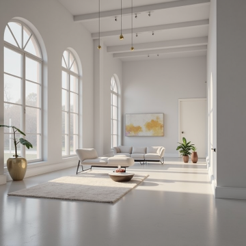
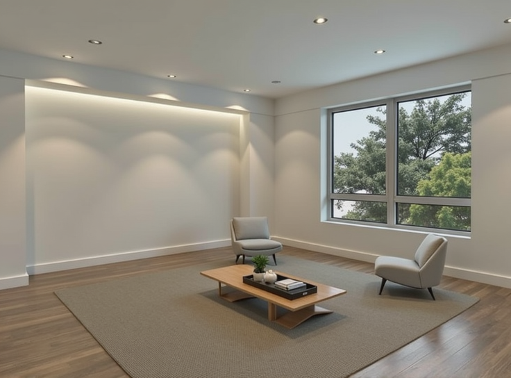

# Interior AI Flux Prototype

This project uses AI models (Gemini, Flux) to visualize interior design concepts. It takes an image of an empty room and a style prompt as input and generates a furnished version.

The application is built with [Next.js](https://nextjs.org) for the frontend and main API logic. A Python [Flask](https://flask.palletsprojects.com/) helper server handles specific backend tasks requiring Python libraries.

## Getting Started

To run this project locally, both the Next.js frontend and the Python Flask helper server must be running concurrently.

**1. Run the Next.js Frontend:**

*   Install dependencies:
    ```bash
    npm install
    # or yarn install / pnpm install / bun install
    ```
*   Run the development server:
    ```bash
    npm run dev
    # or yarn dev / pnpm dev / bun dev
    ```
*   Access the application at [http://localhost:3000](http://localhost:3000).

**2. Run the Python Flask Helper Server:**

This server handles geometric validation and image mask manipulation.

*   Navigate to the Flask directory:
    ```bash
    cd flask_server
    ```
*   Set up a Python virtual environment and install dependencies:
    ```bash
    python -m venv venv
    source venv/bin/activate # On Windows use `venv\Scripts\activate`
    pip install -r requirements.txt
    ```
*   Run the Flask server on the expected port (default 5001):
    ```bash
    flask run --port=5001
    ```

**Environment Variables:**

A `.env.local` file in the root directory is required for API keys (e.g., `FAL_KEY`, `OPENAI_API_KEY`).

## Image Generation Pipeline (`/api/generateImage`)

The main image generation endpoint (`/api/generateImage`) processes requests as follows:

**Summary:** The system analyzes the input room image, generates supporting data (depth/canny maps), uses Gemini to create a layout plan based on the user prompt and room analysis, validates the plan geometrically via the Flask server, and iteratively executes the plan using Flux inpainting (with masks generated by the Flask server), concluding with a final refinement step.

**Process Details:**

1.  **Room Analysis & Asset Generation:**
    *   Generates a **Depth Map** and **Canny Edge Map** from the input room image.
    *   Creates an initial furnished guess (`furnishedImageUrl`) and analyzes it using Florence-2 to identify potential object locations (`florenceResults`).

2.  **Layout Planning (Gemini):**
    *   Gemini receives the analysis data (`florenceResults`, maps), image dimensions, and the user prompt.
    *   It outputs a JSON containing:
        *   `structured_layout`: Defines new furniture items, their bounding boxes, and spatial anchors.
        *   `execution_plan`: A sequence of steps specifying how to add each item (prompt, model, etc.).

3.  **Plan Validation:**
    *   The `structured_layout` is sent to the **Flask server (`/validate_layout`)** for geometric validation against the depth map (checking bounds, depth consistency, overlaps).
    *   **Self-Correction:** If validation fails, Gemini receives feedback detailing the errors and attempts to generate a revised plan (up to 3 attempts total).
    *   The best plan (validated or with the fewest errors) is selected for execution.

4.  **Inpainting Execution Loop:**
    *   The system iterates through the steps in the selected `execution_plan`.
    *   For each step:
        *   The **Flask server (`/generate_mask`)** creates a mask image for the item(s) based on the planned bounding box(es).
        *   **Flux Inpainting** adds the item(s) to the current image state, guided by the mask and the step-specific prompt.
        *   The output image becomes the input for the subsequent step.

5.  **Refinement Step:**
    *   After all items are inpainted, a final **Flux Image-to-Image** pass refines the overall image using the original user prompt at a lower strength for style consistency.

6.  **Response:**
    *   The API returns the URL of the final generated image, along with metadata about the process (e.g., validation status, plan details).

*(The `/api/generateImage2` endpoint exists for separate experimental workflows involving SAM segmentation).*

## Examples

Below are examples showing the original empty room image and the final furnished image generated by the pipeline.

**Example 1:**

| Original                       | Furnished                          |
| :----------------------------- | :--------------------------------- |
|  |  |

**Example 2:**

| Original                       | Furnished                          |
| :----------------------------- | :--------------------------------- |
|  |  |

## Current Challenges

*   **Latency:** The end-to-end generation process involves multiple sequential AI model calls (Gemini, Flux, supporting models, Flask helpers) and can take a significant amount of time (potentially several minutes).
*   **Cost:** Each step in the pipeline invokes API calls to external services (Fal.ai, potentially others like OpenAI) which incur costs based on usage.
*   **Inpainting Limitations:** The quality and richness of the final furnishing can be limited by the nature of the inpainting process. Since the plan is derived from an initial analysis and potential AI "hallucinations" about object placement, the iterative inpainting might not always produce results as rich or detailed as a single image generation model might.
*   **Validation Imperfection:** While the geometric validation step aims to improve plausibility, it's not foolproof and may still allow some geometrically inconsistent layouts to proceed.

## Learn More About Next.js

Refer to the official Next.js resources:

- [Next.js Documentation](https://nextjs.org/docs)
- [Learn Next.js Tutorial](https://nextjs.org/learn)
- [Next.js GitHub Repository](https://github.com/vercel/next.js)

## Deploy on Vercel

Deployment can be done using the [Vercel Platform](https://vercel.com/new?utm_medium=default-template&filter=next.js&utm_source=create-next-app&utm_campaign=create-next-app-readme).

See the [Next.js deployment documentation](https://nextjs.org/docs/app/building-your-application/deploying) for details.
(Note: Full deployment requires deploying the Flask helper server or implementing alternative solutions for its functions).
